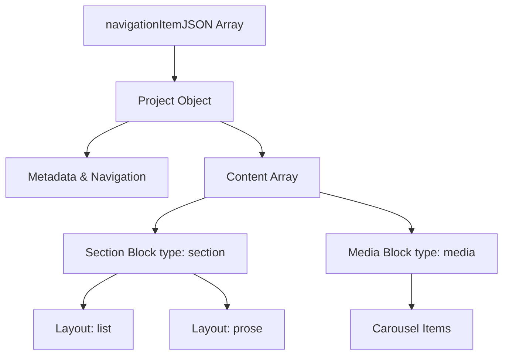

# Data Schema Configuration (`data.js`)

The `src/data/data.js` file serves as the single source of truth for all showcase projects rendered dynamically in this portfolio. It allows defining metadata, layout configurations, and rich media flows in a modular and type-safe structure.

---

## 🏗️ Schema Architecture

The file exports a single constant `navigationItemJSON` which is an array of project objects. Each project object contains both top-level metadata and a dynamic list of structured layout sections under the `content` property.



### 1. Top-Level Project Properties

| Field Name | Type | Description |
| :--- | :--- | :--- |
| `id` | `string` | **Required.** Unique slug identifier (URL path parameter). Matches routing logic in `/navigation/[slug]`. |
| `title` | `string` | **Required.** Full descriptive name of the showcase project. |
| `abbreviation` | `string` | **Required.** Short 2-4 letter capital code used in metadata badges (e.g. `EEB`). |
| `lastUpdated` | `string` | Date of last update/completion (e.g., `4/23/25`). |
| `isPrivate` | `boolean` | Flag for Non-Disclosure Agreement (NDA) status. Shows a `🔒 PRIVATE` lock badge in headers when `true`. |
| `imageSrc` | `string` | URL path to an icon or graphic used in navigation lists. |
| `description` | `string` | **Required.** Primary project intro text. Renders under the heading in the detail view. |
| `content` | `array` | **Required.** Array of dynamic content blocks representing the body of the project. |

---

## 🧩 Content Blocks Reference

The `content` array supports two main types of layout blocks:

### A. Section Blocks (`type: "section"`)

Section blocks render formatted text and structured items under a heading.

- **Properties:**
  - `id` (`string`): Unique identifier for rendering performance.
  - `type` (`string`): Must be `"section"`.
  - `heading` (`string`): Title of the section (rendered in Once UI `heading-default-xl`).
  - `layout` (`"list"` | `"prose"`):
    - `"list"`: Renders items inside a Once UI `<List as="ul" ...>` of bullet points.
    - `"prose"`: Renders items as individual paragraph `<Text>` blocks.
  - `items` (`array`): List of text blocks:
    - `type` (`"text"`): Currently `"text"` is supported.
    - `value` (`string`): The textual content to render.

#### Code Example (Section)

```javascript
{
  id: "block-1",
  type: "section",
  heading: "What I did",
  layout: "list",
  items: [
    { type: "text", value: "Defined the brand’s editorial voice" },
    { type: "text", value: "Set up a content calendar and an ops dashboard" }
  ]
}
```

---

### B. Media Blocks (`type: "media"`)

Media blocks capture image, video, or gif lists and display them inside a premium, interactive Once UI `<Carousel>` element.

- **Properties:**
  - `id` (`string`): Unique identifier for rendering performance.
  - `type` (`string`): Must be `"media"`.
  - `heading` (`string`): Section heading.
  - `items` (`array`): Array of media asset objects. The renderer will automatically filter out any objects lacking a valid `src` URL.
    - `src` (`string`): The absolute URL or local path to the media.
    - `alt` (`string`): Alternative description text for visual accessibility and screen readers.
    - `caption` (`string`): Visual description or credit (currently metadata, reserve for future captions).

#### Code Example (Media)

```javascript
{
  id: "block-3",
  type: "media",
  heading: "Project Gallery",
  items: [
    {
      src: "https://your-domain.com/dashboard-preview.png",
      alt: "Interface showing workspace metrics",
      caption: "Operations metrics panel interface."
    },
    {
      src: "https://www.youtube.com/watch?v=RDuVmE95IWQ",
      alt: "Interactive walk-through of the blog layout",
      caption: "Interactive user experience demo."
    }
  ]
}
```

---

## 🛠️ Step-by-Step: Adding a New Project

To add a new project to your portfolio, follow these steps:

1. Open `src/data/data.js`.
2. Append a new object inside the exported `navigationItemJSON` array.
3. Configure the metadata (`id`, `title`, `abbreviation`, `lastUpdated`, `isPrivate`, `imageSrc`, and `description`).
4. Build out your `content` array using `section` (either `"list"` or `"prose"` layout) and `media` carousel blocks.
5. Format the file using Biome:

   ```bash
   bun run biome-write
   ```

6. The new project will automatically register in the `/navigation` list and dynamically generate its details route at `/navigation/[id]`.
